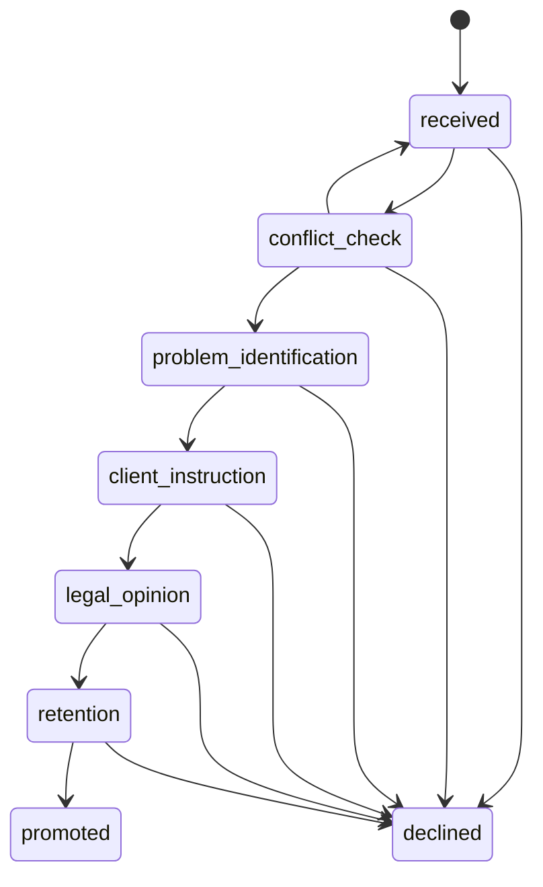
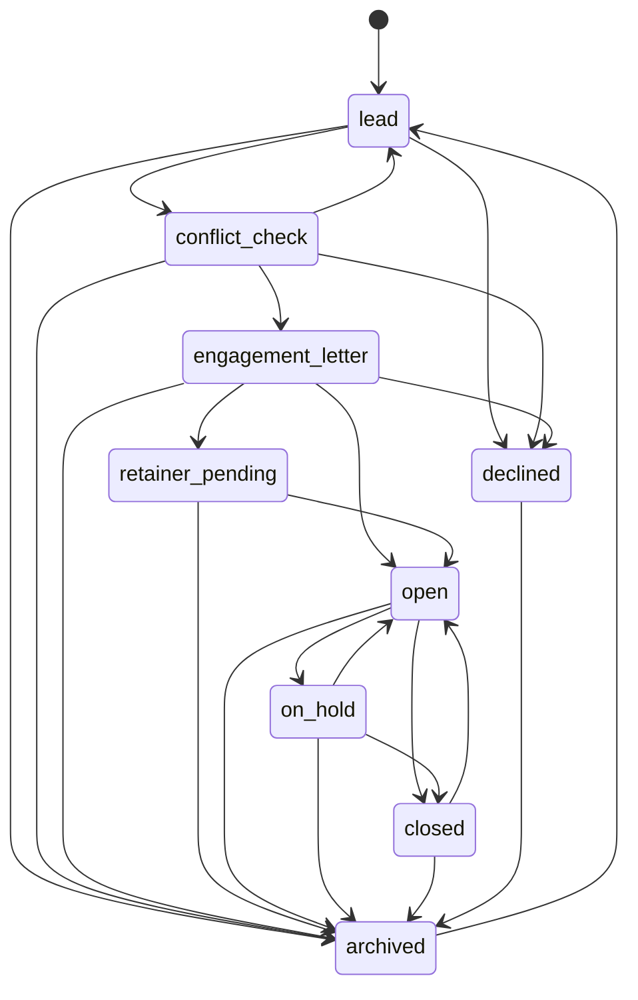

# Matters & Intake: replication-ready audit

## Purpose and boundary

This is an as-built audit of the current implementation, not a future-state brief. It explains how an external team can reproduce the Intake and Matters capability without needing oral context.

The system has two connected records and two state machines:

```text
Public enquiry / appointment
  -> submissions (Intake)
  -> legal_matters (Matter lifecycle)
```

`submissions` is the pre-engagement record. `legal_matters` is the governed client-work record. Promotion does not copy work into a new silo: it links the two records and carries forward conflict checks, documents, client identity, and audit history.

## 1. Actors and permissions

| Actor / permission | Responsibility |
|---|---|
| Public visitor | Creates contact or appointment submissions; receives tracking code and status updates. |
| `triage_intake` | Views the submissions register. |
| `manage_forms` | Advances non-conflict Intake steps and records their notes. |
| `run_conflict_check` | Runs conflict searches; required for Intake `received -> conflict_check` and Matter `lead -> conflict_check`. |
| `approve_conflict_waiver` | Records the decision to proceed/decline after a Matter conflict check. |
| `manage_matters` | Creates, edits, transitions and archives matters. |
| Partner/administrator | Operationally owns acceptance, waivers, and any decision to decline. The precise role policy is enforced through the permission checks above. |

All staff-facing APIs establish identity server-side. Mutating routes write to the audit log. The UI should never be treated as the access-control layer.

## 2. Intake journey

### 2.1 Entry channels

1. Public Contact form creates `submissions.type = contact`.
2. Public Appointment flow creates `submissions.type = appointment`.
3. Other submission types (career, volunteer, paper, etc.) use the same generic table but **do not enter legal intake**: `intake_stage = NULL`.
4. Staff can review the queue at `/admin/submissions`; opening a pending item records its first-open time and changes generic status to `under_review` when the activity-timeline migration is available.

### 2.2 Submission creation contract

`POST /api/submissions` requires:

| Field | Required | Notes |
|---|---:|---|
| `type` | yes | `contact` and `appointment` are legal-intake candidates. |
| `submitter_name` | yes | Stored on the submission and used for future client-profile creation. |
| `submitter_email` | yes | Used for confirmation, tracking, and client de-duplication. |
| `submitter_phone` | no | Stored if supplied. |
| `data` | no | Type-specific form answers as JSON. |

Creation side effects:

1. Create a tracking code.
2. Run AI analysis on a best-effort basis; store `ai_summary` and `ai_score` when available.
3. Set `status = pending`.
4. Set `intake_stage = received` only for contact/appointment submissions.
5. Upsert the person onto the mailing list, best effort.
6. Send a confirmation email, best effort.
7. Insert a public `submission_updates` record announcing receipt.

The public form must succeed if optional AI, email, mailing-list, or newer intake-schema capabilities fail.

### 2.3 Intake state machine



| State | User-facing label | Required evidence / form | Permitted next states |
|---|---|---|---|
| `received` | Client Request | Original submission and attached type-specific JSON. | Conflict Check, Declined |
| `conflict_check` | Conflict Check | Search and a documented conflict-check record. | Problem Identification, Received, Declined |
| `problem_identification` | Problem Identification | Required short narrative: what the client actually needs. | Client Instruction, Declined |
| `client_instruction` | Client Instruction | Required short narrative: what the firm was asked to do. | Legal Opinion, Declined |
| `legal_opinion` | Legal Opinion | Required short narrative: advice given. | Retention, Declined |
| `retention` | Retention | Promotion action, not a plain stage button. | Promoted, Declined |
| `promoted` | Promoted to Matter | Created Matter link and inherited artefacts. | terminal |
| `declined` | Declined | Optional decline note. | terminal |

The API validates the requested Intake transition with `canTransitionIntake`. It checks permissions before a transition; `received -> conflict_check` requires `run_conflict_check`, while other transitions use `manage_forms`.

### 2.4 Intake detail-page structure

The staff detail page is `/admin/submissions/[id]`. Its principal operational elements are:

- Submission identity, contact information, source/type, tracking code and generic review status.
- Activity timeline (`submission_events`) and public/client-visible updates (`submission_updates`).
- Intake Pipeline stepper (`PipelineStepper`): one selected stage at a time, rather than all stage forms at once.
- Conflict panel at Client Request/Conflict Check. It searches current/former clients, opposing parties and related matters; its decision is auditable.
- A three-row note form for Problem Identification, Client Instruction and Legal Opinion. Saving advances the stage and creates a `submission_notes` row linked to the stage.
- Per-stage assignments. The Assignment Composer is passed `submissionId`, `stageKey`, `stageLabel` and client name, so the assignee does not re-enter context.
- Retention panel and Promote to Matter action.
- Ability to decline a non-terminal enquiry.

### 2.5 Generic submission operations

`PATCH /api/submissions/[id]` may change generic status, assignee, internal notes, public update/message, restore a soft-deleted record, or progress `intake_stage`.

- Generic status is separate from Intake state. It is for queue handling and client communication; do not substitute it for the legal Intake workflow.
- A public status update creates `submission_updates` and sends an email.
- Assignment changes and status changes create timeline events when supported.
- `DELETE /api/submissions/[id]` is a soft delete (`deleted_at`); it remains auditable and can be restored.

## 3. Conflict-check journey

The same `conflict_checks` table serves both Intake and Matter phases.

| Field | Meaning |
|---|---|
| `submission_id` | Filled before promotion. |
| `matter_id` | Filled for a Matter check, or backfilled on promotion. |
| `search_query` | Search terms used. |
| `results` | JSON result set retained as evidence. |
| `highest_risk` | `none`, `low`, `medium`, or `high`. |
| `decision` | `pending`, `proceed`, `proceed_with_conditions`, or `declined`. |
| `decision_notes`, `decided_by`, `decided_at` | Partner decision record. |

Design rule: a search alone is not clearance. The documented decision to proceed is required before a Matter can progress into Engagement Letter.

## 4. Promotion: Intake to Matter

Promotion is triggered from the Retention stage. It calls `POST /api/files/matters` with `submission_id` plus the Matter form values.

Preconditions:

1. The submission must not have `intake_stage = declined`.
2. The user needs `manage_matters`.
3. A Matter created from a submission defaults to `lead`, not `open`.

Promotion side effects, in order:

1. Create or use an `engagements` wrapper.
2. Create `legal_matters`, link `submission_id`, and generate `matter_number`.
3. Insert first Matter stage-history entry and Matter audit entry.
4. Find/create a client `profiles` record by the submitter email; attach it to the Matter where the schema supports that link.
5. Write `submission_events.type = promoted`.
6. Change the submission's `intake_stage` to `promoted`.
7. Update pre-matter `conflict_checks.matter_id` to the new Matter.
8. Link any intake-created `legal_documents` to the new Matter instead of duplicating them.

This hand-off is intentionally one continuous file story: the submission remains the source record for the enquiry and the Matter becomes the source record for legal work.

## 5. Matter journey

### 5.1 Matter creation paths

| Path | Default state | Intended use |
|---|---|---|
| Promote a legal submission | `lead` | Standard path for public intake. |
| Staff creates a Matter directly | `open` unless explicitly supplied | Already-vetted or migrated work. |

The create form must collect, at minimum, a title/description, client identity or engagement, and the work classification. The current reference-driven form also selects Practice Area, Matter Type, Court, county, claim value, opposing party, assigned attorney, tags and litigation details when applicable.

### 5.2 Matter state machine



| State | Gate / evidence | Primary work |
|---|---|---|
| `lead` | New file; pre-engagement facts. | KYC, scope, documents, consultation. |
| `conflict_check` | `run_conflict_check` permission to enter. | Search and obtain a decision. |
| `engagement_letter` | A documented conflict decision to proceed is enforced before entry. | Draft, send, sign and confirm fee arrangement. |
| `retainer_pending` | Engagement accepted; funding not complete. | Invoice, chase and confirm retainer. |
| `open` | Active instruction. | Legal work, court process, documents, time, billing, assignments and calendar. |
| `on_hold` | Paused active matter. | Follow-up/reactivation review. |
| `closed` | Work completed. | Closing letter, final bill, archival review. |
| `declined` | Not accepted / cannot proceed. | Archive when appropriate. |
| `archived` | Soft-retained historical record. | May be restored to Lead. |

Permissions: `lead -> conflict_check` requires `run_conflict_check`; `conflict_check -> engagement_letter` and `conflict_check -> declined` require `approve_conflict_waiver`; all other state transitions require `manage_matters`.

### 5.3 Matter detail-page structure

The Matter detail at `/admin/matters/[id]` is the work-file workspace. Replicate these functional areas:

1. Identity: Matter number, title, client, practice/matter type, owner, status and visibility/access context.
2. Lifecycle: current state, stage history and only valid transition controls.
3. Conflict and engagement: conflict records/decision, engagement letter and retainer state.
4. Work execution: stage-context assignments, tasks, review/approval messages and completion effects.
5. Evidence and documents: document list, revisions, restores, access levels and intake-document carryover.
6. Legal operations: court, case number, litigation status, court dates, opposing party, claim value and county.
7. Commercial work: time entries, fee estimates, invoices and payment-related work.
8. Matter history: notes, timeline events and auditable changes.

### 5.4 Matter API behavior

`GET /api/files/matters` supports pagination, search, type/status/attorney/submission filters and stage-count/bottleneck metrics. It scopes results through `getMatterAccessScope`.

`POST /api/files/matters` creates the engagement wrapper if one is not supplied, creates the Matter, starts stage history, logs audit data and executes the promotion side effects above.

`GET|PATCH|DELETE /api/files/matters/[id]` reads, edits and archives one Matter.

- Editing revisioned fields saves a pre-change revision.
- Restoring a revision saves the current version first, then restores the selected version.
- Entering Engagement Letter checks for a conflict decision of `proceed` or `proceed_with_conditions`.
- Delete is archival (`status = archived`), not destructive deletion.

## 6. Core data model

| Entity | Ownership / purpose | Critical relationships |
|---|---|---|
| `submissions` | Any inbound request; legal Intake only for contact/appointment. | One may promote to a Matter. |
| `submission_updates` | Client-facing status communication. | `submission_id`. |
| `submission_events` | Internal timeline. | `submission_id`, actor. |
| `submission_notes` | Narrative evidence for Intake stages. | `submission_id`, stage, author. |
| `conflict_checks` | Auditable search and decision. | Exactly one target: submission and/or Matter during handoff. |
| `engagements` | Client engagement wrapper around one or more Matters. | Client, creator, Matters. |
| `legal_matters` | Controlled work record and state machine. | Submission, engagement, client, court, assignee, documents, assignments. |
| `matter_stage_history` | Time entered/left stages and cycle-time source. | `matter_id`. |
| `matter_notes`, `matter_tasks` | Operational record and work. | `matter_id`. |
| `assignments`, messages, assignment tasks | Delegated work and approval workflow. | May target a Matter or a Submission stage. |
| `legal_documents` and revisions | File evidence and recoverable versions. | Submission before promotion; Matter after promotion. |
| `courts`, `practice_areas`, `matter_types`, templates | Reusable reference data. | Referenced by Matter classification/filing. |

## 7. Replication requirements

### Required routes and UI

- Public Contact and Appointment forms, tracking page, status-email templates.
- Admin Submissions list and detail page with Intake stepper, conflict check, notes, assignment composer, decline and promotion actions.
- Admin Matters list, create form, detail workspace, lifecycle controls, documents/revisions, assignments, court/calendar and finance integrations.
- Hubs for practice/matter taxonomy, courts and other firm reference data.

### Required platform services

- Database transactions or compensating recovery for promotion side effects.
- Server-side permission enforcement and audit log.
- Email provider; failure must not reject a valid public intake submission.
- Optional AI triage; failure must not reject a valid public intake submission.
- Object storage and document revision service.
- Calendar/notification provider abstraction for meetings, court dates and deadlines.

### Required schema migrations

At minimum: `010_matter_lifecycle.sql`, `013_matter_notes_tasks.sql`, `014_submission_events.sql`, `017_intake_pipeline.sql`, `025_courts_and_litigation.sql`, `030_conflict_engine.sql`, `031_assignments_and_pipeline_stages.sql`, `032_assignments_submission_link.sql`, `033_documents_submission_link.sql`, `038_workflow_completion_engine.sql`, `039_matter_management_reference_layer.sql`, and `040_assignment_orchestration_v3.sql`.

## 8. Implementation observations and replication cautions

1. **Do not merge generic submission status with legal Intake stage.** Status is communication/queue state; `intake_stage` is the legal decision workflow.
2. **Do not treat a conflict search as clearance.** The recorded decision is the gate.
3. **Promotion must be idempotent or transactionally protected.** It spans Matter, engagement, client profile, submission events/stage, conflict records and documents.
4. **Do not hard-delete.** Submissions and Matters are archived/soft-deleted for auditability.
5. **Keep reference values controlled.** Practice areas, matter types, courts and templates belong to Hubs, not ad-hoc fields on a Matter form.
6. **Assignments need stage context.** A task belongs to a specific Intake or Matter lifecycle step, not merely to a person.
7. **The code has compatibility fallbacks for partially migrated deployments.** A clean replication should apply the complete migration chain and remove the need for those fallbacks.
8. **Some state-gate enforcement is API-level, not database-level.** A replacement must retain it in an authoritative service layer or add database constraints/workflow commands; never rely on disabled buttons alone.

## Source map

- `src/lib/intakeLifecycle.ts`
- `src/lib/matterLifecycle.ts`
- `src/components/admin/PipelineStepper.tsx`
- `src/app/api/submissions/route.ts`
- `src/app/api/submissions/[id]/route.ts`
- `src/app/api/files/matters/route.ts`
- `src/app/api/files/matters/[id]/route.ts`
- `supabase/migrations/010_matter_lifecycle.sql`
- `supabase/migrations/017_intake_pipeline.sql`
- `supabase/migrations/030_conflict_engine.sql`
- `supabase/migrations/031_assignments_and_pipeline_stages.sql`
- `supabase/migrations/039_matter_management_reference_layer.sql`
