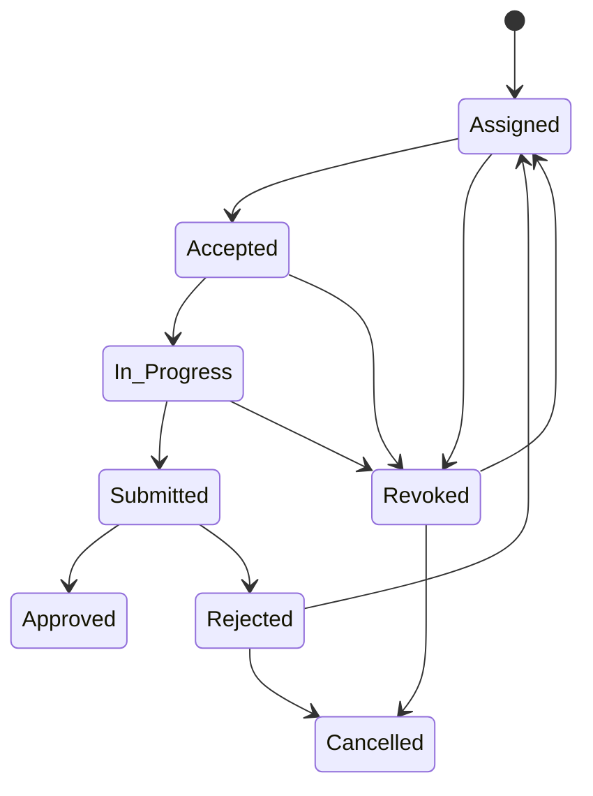

# People, Assignments & Calendar: replication-ready audit

## Purpose and system boundary

This is an as-built specification of three connected capabilities:

```text
Profiles / team members (People)
   -> create accountable work (Assignments)
   -> date-bound commitments and visibility (Calendar)
```

`profiles` is the person-of-record. `team_members` is the employment/work-capacity record for an internal person. An Assignment always has a `team_members` assignee; a Calendar event can include internal team members, profile-based clients, and external guests.

## 1. People

### 1.1 Purpose and journeys

The legacy `/admin/people` list redirects to `/admin/clients`; individual records remain at `/admin/people/[id]`. It is a relationship workspace, not a separate matter or billing system.

| Journey | Start | Outcome |
|---|---|---|
| Create a client/public/volunteer profile | Client directory / `POST /api/people` | A `profiles` row, optionally later linked to matters. |
| Create a privileged/internal identity | User-administration flow | A profile with a privileged role; team membership is a separate record. |
| Review a person | `/admin/people/[id]` | Consolidated matters, invoices, submissions and appointments. |
| Give a client portal access | Person detail → Send Portal Access Link | Passwordless Supabase OTP email redirecting to `/portal`. |
| Update / deactivate | Person management API | Updated profile or `is_active = false`; never a hard delete. |

### 1.2 Data contract

`profiles` stores at least: `id`, `user_id` (nullable), `full_name`, `email`, `phone`, `role`, `is_active`, `created_at`, and `updated_at`.

Relationships are deliberately resolved rather than duplicated:

| Information shown on person detail | Join / lookup |
|---|---|
| Matters | `matter_people.profile_id -> legal_matters` |
| Invoices | invoices for those matter IDs, excluding soft-deleted invoices |
| Enquiries | `submissions.submitter_email = profiles.email` |
| Appointments | `appointments.client_email = profiles.email` |
| Portal status | `profiles.user_id` |

Email matching means it is an integration key: normalise and verify it before creating duplicates. A clean replacement should use a durable client relationship ID on every related record as well, while retaining email as a contact value.

### 1.3 Forms, validation and permission model

`POST /api/people` accepts the supplied profile body. `role` defaults to `public`.

| Action | Required authority |
|---|---|
| List/read People | Admin session |
| Create `client`, `volunteer`, `public` | `manage_matters` |
| Create any more privileged role | `manage_users` |
| Edit role or activation / deactivate | `manage_users` |
| Send portal link | Admin session |

The portal invitation form needs only `profile_id`. The server finds the email/name, calls Supabase passwordless sign-in with `shouldCreateUser: true`, and audits that a portal link was sent. It should not expose a password-management journey for clients.

### 1.4 Detail screen structure

1. Identity card: name, email, phone, role, portal state and portal-link action.
2. Standing summary: Matter, Appointment and Enquiry counts, plus sent-invoice outstanding balance.
3. Matters: number, stage, title, type and opening date, linked to the matter workspace.
4. Appointments: scheduled date/time, matter type, status and attorney, linked to the appointments register.
5. Invoices: number, lifecycle status, issue/due information and total, linked to its matter.
6. Enquiries: tracking code, type, status and date, linked to Intake.

The person page is read/relationship-centred. Profile administration must be provided from the client/user-management form, not improvised inside this screen.

### 1.5 CRUD and audit behaviour

Create, read and update are implemented. Delete is a reversible deactivation (`is_active=false`) and is audited as `DELETE`; no personal record is physically erased. Insert/update/deactivation operations call `logAudit` on `profiles`.

## 2. Assignments

### 2.1 Purpose

Assignments are the single work-tracking system. They attach accountable work to a Matter, an Intake submission, or a reusable `work_item`; an intake assignment can automatically inherit its promoted Matter. This avoids a separate task silo and retains stage context.

### 2.2 Creation paths and form contract

Assignments are created from Matter/Intake lifecycle panels or the activity/work-item system, not from an uncontextualised global form.

| Field | Required | Behaviour |
|---|---:|---|
| `assigned_to` | yes | Active `team_members.id`; a matter client may not be selected. |
| One of `matter_id`, `submission_id`, `work_item_id` | yes | Determines the work context. |
| `activity_type_id` | no | Creates a `work_items` record first and supplies its title/instructions/due default. |
| `stage_key` | no but expected in pipeline work | Lifecycle key (`legal_matters.status` or `submissions.intake_stage`). |
| `stage_id` | optional legacy/reference field | Not the operational completion key. |
| `instructions` | optional | Defaulted from the activity type or the submission type when omitted. |
| `message` | optional | Becomes a separate author comment after the system creation message. |
| `due_date` | optional | Appears as a deadline in Calendar. |

On creation the service creates an `assignments` row in `Assigned`, writes a System message, optionally writes the assigner comment, and—when it targets a submission—updates `submissions.assigned_to` and adds an `assigned` submission event (best effort).

### 2.3 Assignment state machine



`Assigned`, `Accepted`, `In Progress`, `Submitted`, `Approved`, `Rejected`, `Revoked`, and `Cancelled` are presentation/API values (spaces and capitalisation are significant in the current implementation). The assignee accepts, starts, and submits; the original assigner approves or rejects. Rejection requires a reason. Rejected or revoked work can be returned to the original assignee, assigned to another eligible team member, claimed by the original assigner, or cancelled.

Approval is the terminal successful review. An approved Matter assignment can then be sent to the client; the current endpoint records the intent/system message but its email provider is explicitly a placeholder and must be replaced in a production replication.

### 2.4 Detail-page structure

`/admin/assignments/[id]` should contain:

1. Work identity and status: instructions, due date, assignee/assigner and contextual Matter or Intake record.
2. Context: Matter facts, team/conflict information, or Intake data and public updates.
3. Work action panel: context-sensitive Accept / Start / Submit controls; submission-only work has structured written response plus optional link.
4. Review panel: Approve or reject with mandatory feedback; reassignment decision form after rejection/revocation.
5. Conversation: timestamped System, Comment, Review and Decision messages; URLs are rendered as links.
6. Deliverables: authorised parties upload documents, stored as `legal_documents` with both Matter/Submission/Assignment links.
7. Optional execution tasks: sequenced subtasks with assignee, dependency and estimated/actual hours.

### 2.5 Visibility, API and task rules

`GET /api/assignments` returns work scoped to the caller. Admin-tier users can filter; other users are forcibly limited to work they created or are assigned. Supported filters include Matter, Submission, status, `assigned_to=me`, and `created_by=me`.

`GET|PATCH /api/assignments/[id]` performs authorised detail read and lifecycle actions. The exact actor checks are server-side: UI visibility is not authority. The assigner, assignee, and admins can access the record; only the original assigner makes review/reassignment decisions.

`/tasks` supports sequential execution:

- only the assigner creates tasks (`title`, integer `sequence`, optional `assignee_id`, predecessor, estimated hours);
- a task begins only from `PENDING`, and its dependency must be `DONE`;
- it completes only from `IN_PROGRESS`, optionally capturing actual hours.

### 2.6 Completion effects and caution

The assignment-completion engine can advance its stage/workflow where configured; replication must preserve the `stage_key` rather than rely on the old `stage_id`. Completion, document attachment and messages are evidence, not merely UI decoration.

## 3. Calendar

### 3.1 Purpose and aggregation

Calendar is a firm diary, not a duplicate schedule for each domain. It combines:

| Source | Display / ownership |
|---|---|
| `calendar_events` | Meetings, internal events, court entries, deadlines and other diary entries. |
| `appointments` | Consultations; remain managed through the Appointments register. |
| `assignments.due_date` | Read-only deadline overlay linking back to Assignments. |

The month grid uses a ring for a meeting/event and colour priority for assignment urgency; the agenda lists the next 90 days. Selecting a day exposes both sources without treating assignments as calendar-event rows.

### 3.2 Event creation form and validation

The Schedule Meeting modal calls `POST /api/calendar-events`.

| Field | Required | Notes |
|---|---:|---|
| Title | yes | Plain event title. |
| Type | no | `meeting` default; interface offers `meeting`, `internal`, `court`, `deadline`, `other`. |
| Date/start/end | yes | Server requires `end_at > start_at`. |
| Location, meeting link, notes | no | Saved on event. |
| Matter/submission/job application | contextual/optional | Link only when created from the relevant workflow. `job_application_id` must be omitted for ordinary events on databases without migration 043. |
| Colleagues | optional | `team_member_id` entries. |
| Client/profile guest | optional | `profile_id` entries. |
| External guest | optional | `external_name`, `external_email`; no account is needed. |

The event is persisted first. Attendee rows are then created and notifications sent best-effort with an ICS invitation; an email failure does not reject a valid diary entry. Successful notifications set `notified_at` on the attendee row.

### 3.3 Lifecycle and CRUD

| Operation | Route | Result |
|---|---|---|
| List | `GET /api/calendar-events` | Excludes `cancelled`; optional from/to/Matter/Submission filters. |
| Read one | `GET /api/calendar-events/[id]` | Event with creator, links and attendees. |
| Create | `POST /api/calendar-events` | Validated event, attendee records, best-effort invites, audit event. |
| Edit / reschedule / cancel status | `PATCH /api/calendar-events/[id]` | Allowlist of core fields; reschedule/cancellation emails a replacement ICS event. |
| Cancel | `DELETE /api/calendar-events/[id]` | Soft cancellation (`status='cancelled'`), not physical deletion. |

Existing attendee lists are not currently editable through the single-event PATCH contract. Replication should add an explicit attendee reconciliation endpoint if full attendee CRUD is required.

### 3.4 Court-calendar path

Court dates are `calendar_events` of `type='court'`; there is deliberately no second court-dates table.

- `POST /api/court-dates` requires a Matter and start date, defaults a missing duration to one hour, and writes a scheduled calendar event.
- `GET` can return upcoming/past/all court events and enriches the linked Matter court record.
- `PATCH` updates one court event; `DELETE` cancels it to preserve the procedural history.
- This path requires `manage_matters`, while ordinary Calendar uses the admin-session guard.

### 3.5 Core data model and required services

| Entity | Key fields / relationships |
|---|---|
| `calendar_events` | title, description, type, start/end, location, meeting link, status, creator; optional Matter, Submission, Job Application. |
| `calendar_event_attendees` | event plus exactly one internal team member, profile, or external contact representation. |
| `appointments` | separate consultation record surfaced read-only in Calendar. |
| `assignments` | due date only; displayed as an overlay, not copied. |

Calendar event mutations call `logAudit`. The ICS/email service must support invitations and updates/cancellations using a stable event UID. Treat email as a resilient side effect, not a database transaction precondition.

## 4. Replication requirements and source map

Apply, at minimum, profile/auth/team migrations plus `015_calendar.sql`, `031_assignments_and_pipeline_stages.sql`, `032_assignments_submission_link.sql`, `038_workflow_completion_engine.sql`, `040_assignment_orchestration_v3.sql`, and `043_calendar_job_application_link.sql`.

Primary sources:

- `src/app/admin/people/[id]/page.tsx`
- `src/app/api/people/route.ts`, `[id]/route.ts`, `[id]/overview/route.ts`, `invite/route.ts`
- `src/app/admin/assignments/page.tsx`, `[id]/page.tsx`
- `src/app/api/assignments/route.ts`, `[id]/route.ts`, `[id]/tasks/route.ts`, `[id]/reassign/route.ts`, `[id]/documents/route.ts`, `[id]/send-to-client/route.ts`
- `src/app/admin/calendar/page.tsx`
- `src/app/api/calendar-events/route.ts`, `[id]/route.ts`, `src/app/api/court-dates/route.ts`
